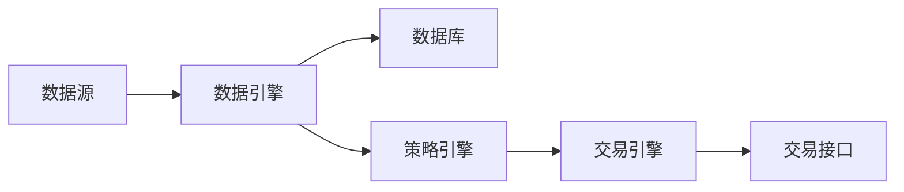

# TradeTools 系统设计文档

## 1. 数据源整合

### 1.1 现有数据源
- **Polygon**: 实时行情、历史数据、公司新闻
- **FinancialModelPrep**: 财务数据、分析报告
- **Interactive Brokers**: 实时行情、新闻、交易执行
- **OpenBB**(计划中): 另一个综合数据源

### 1.2 数据标准化
为了统一处理不同来源的数据，我们需要建立统一的数据模型：

```python
# 标准化数据模型示例
class StandardizedNews:
    source: str  # 数据来源
    timestamp: datetime
    title: str
    content: str
    symbols: List[str]
    sentiment: Optional[float]
    
class StandardizedMarketData:
    source: str
    symbol: str
    timestamp: datetime
    price: float
    volume: float
    additional_info: Dict
```

### 1.3 数据同步策略
- 使用消息队列(如Redis)处理实时数据流
- 使用DolphinDB存储结构化数据
- 使用MongoDB存储非结构化数据(如新闻)

## 2. UI设计 (参考VnPy)

### 2.1 主要功能区域
1. **市场数据区**
   - 行情报价表
   - K线图表
   - 成交明细

2. **交易操作区**
   - 下单面板
   - 持仓监控
   - 委托管理

3. **数据分析区**
   - 技术分析
   - 新闻资讯
   - 财务数据

4. **系统管理区**
   - 账户管理
   - 风控设置
   - 日志查看

### 2.2 UI组件结构
```
MainWindow
├── MenuBar
├── ToolBar
├── MarketDataWidget
│   ├── QuoteTable
│   ├── ChartWidget
│   └── OrderBook
├── TradingWidget
│   ├── OrderPanel
│   ├── PositionMonitor
│   └── OrderMonitor
├── AnalysisWidget
│   ├── TechnicalAnalysis
│   ├── NewsPanel
│   └── FinancialData
└── StatusBar
```

## 3. 系统架构

### 3.1 核心组件
1. **数据引擎(DataEngine)**
   - 统一数据接口
   - 数据缓存管理
   - 数据持久化

2. **交易引擎(TradeEngine)**
   - 订单管理
   - 仓位管理
   - 风险控制

3. **策略引擎(StrategyEngine)**
   - 策略加载
   - 信号生成
   - 绩效分析

4. **事件引擎(EventEngine)**
   - 事件分发
   - 任务调度
   - 消息通知

### 3.2 数据流


## 4. 环境配置

### 4.1 数据库配置
```yaml
databases:
  dolphinDB:
    host: localhost
    port: 8848
    database: tradetools
    tables:
      - market_data
      - orders
      - trades
      - positions
  
  postgres:
    host: localhost
    port: 5432
    database: tradetools
    tables:
      - account
      - position
  
  mongodb:
    host: localhost
    port: 27017
    database: tradetools
    collections:
      - news
      - financial_reports
      
  redis:
    host: localhost
    port: 6379
    channels:
      - market_data
      - trading_signals
```

### 4.2 API配置
```yaml
api_keys:
  polygon:
    key: ${POLYGON_API_KEY}
    rate_limit: 5/min
    
  financial_model_prep:
    key: ${FMP_API_KEY}
    rate_limit: 10/min
    
  interactive_brokers:
    port: 7496
    client_id: 1
```

## 5. 开发计划

### 5.1 第一阶段
- [x] IB接口基础功能
- [x] 数据源基础整合
- [ ] UI框架搭建
- [ ] 数据库配置

### 5.2 第二阶段
- [ ] 新闻数据整合
- [ ] 策略引擎完善
- [ ] 回测系统
- [ ] UI功能完善

### 5.3 第三阶段
- [ ] OpenBB集成
- [ ] 性能优化
- [ ] 自动化测试
- [ ] 部署文档

## 6. 注意事项

### 6.1 数据一致性
- 使用统一的时区(UTC)
- 统一的数据格式标准
- 数据验证和清洗流程

### 6.2 性能考虑
- 使用异步处理
- 实现数据缓存
- 优化数据库查询
- 使用连接池

### 6.3 安全性
- API密钥管理
- 访问控制
- 日志记录
- 错误处理

## 7. 参考资源
- VnPy项目结构和UI设计
- IB API文档
- Polygon API文档
- FinancialModelPrep API文档

## 8. 开发进展

### 8.1 已完成功能

#### 8.1.1 IB接口基础功能
- [x] 连接和初始化
- [x] 行情订阅和处理
- [x] 交易功能（下单、撤单、成交）
- [x] 查询功能（账户、持仓、委托）
- [x] 新闻数据接口

#### 8.1.2 数据源整合框架
- [x] 标准化数据模型
- [x] 新闻数据引擎
- [x] 数据源基类
- [x] 事件驱动架构

### 8.2 待开发功能

#### 8.2.1 数据库集成 (优先级：高)
1. **DolphinDB**
   - [ ] 设计数据表结构
     - 分钟级行情数据表
     - Tick级行情数据表
     - 日线数据表
     - 期权数据表
   - [ ] 实现数据访问层
     - 高性能数据写入接口
     - 批量数据查询接口
     - 实时数据订阅接口
   - [ ] 添加数据同步机制
     - 实时数据同步
     - 历史数据补充
     - 数据校验和修复
   - [ ] 性能优化
     - 分区策略优化
     - 内存管理
     - 查询性能优化

2. **PostgreSQL** (次优先)
   - [ ] 设计数据表结构
     - 交易记录表
     - 账户资金表
     - 持仓记录表
   - [ ] 实现数据访问层
   - [ ] 添加数据同步机制

3. **MongoDB** (次优先)
   - [ ] 设计文档结构
     - 新闻数据集合
     - 财务报告集合
     - 研究报告集合
   - [ ] 实现数据访问接口
   - [ ] 添加索引优化

4. **Redis** (次优先)
   - [ ] 设计缓存结构
     - 实时行情缓存
     - 订单状态缓存
     - 会话管理
   - [ ] 实现消息队列
   - [ ] 添加数据过期策略

#### 8.2.2 UI开发 (优先级：中)
1. **主界面框架**
   - [ ] 菜单栏和工具栏
   - [ ] 状态栏
   - [ ] 多文档界面

2. **市场数据模块**
   - [ ] K线图表组件
   - [ ] 行情报价表
   - [ ] 成交明细表
   - [ ] 深度行情图

3. **交易操作模块**
   - [ ] 下单面板
   - [ ] 持仓监控
   - [ ] 委托管理
   - [ ] 成交记录

4. **数据分析模块**
   - [ ] 技术分析工具
   - [ ] 新闻资讯面板
   - [ ] 财务数据展示

#### 8.2.3 数据源接口 (优先级：中)
1. **Polygon**
   - [ ] 实时行情接口
   - [ ] 历史数据接口
   - [ ] 新闻数据接口
   - [ ] 数据格式转换

2. **FinancialModelPrep**
   - [ ] 财务数据接口
   - [ ] 公司信息接口
   - [ ] 分析报告接口
   - [ ] 数据缓存机制

3. **OpenBB** (预留)
   - [ ] 接口设计
   - [ ] 数据模型映射
   - [ ] 功能集成计划

#### 8.2.4 回测系统 (优先级：低)
1. **数据管理**
   - [ ] 历史数据加载
   - [ ] 数据预处理
   - [ ] 数据切片机制

2. **回测引擎**
   - [ ] 事件驱动框架
   - [ ] 订单管理系统
   - [ ] 仓位管理系统

3. **性能分析**
   - [ ] 交易统计
   - [ ] 绩效指标
   - [ ] 风险分析

### 8.3 开发计划

#### 第一阶段：数据基础设施
1. 实现DolphinDB集成
   - 建立连接池
   - 实现数据表结构
   - 开发数据访问接口
   - 优化性能
2. 实现PostgreSQL数据库集成
3. 实现MongoDB数据库集成
4. 实现Redis缓存系统

#### 第二阶段：UI框架
1. 实现主界面框架
2. 开发市场数据模块
3. 开发交易操作模块
4. 开发数据分析模块

#### 第三阶段：数据源整合
1. 集成Polygon数据源
2. 集成FinancialModelPrep数据源
3. 预留OpenBB接口

#### 第四阶段：回测系统
1. 实现数据管理系统
2. 开发回测引擎
3. 添加性能分析工具

### 8.4 注意事项

#### 8.4.1 代码质量
- 遵循PEP 8规范
- 添加类型注解
- 编写单元测试
- 添加文档字符串

#### 8.4.2 性能优化
- 使用异步操作
- 实现数据缓存
- 优化数据库查询
- 使用连接池

#### 8.4.3 可维护性
- 模块化设计
- 清晰的代码结构
- 完善的错误处理
- 详细的日志记录
